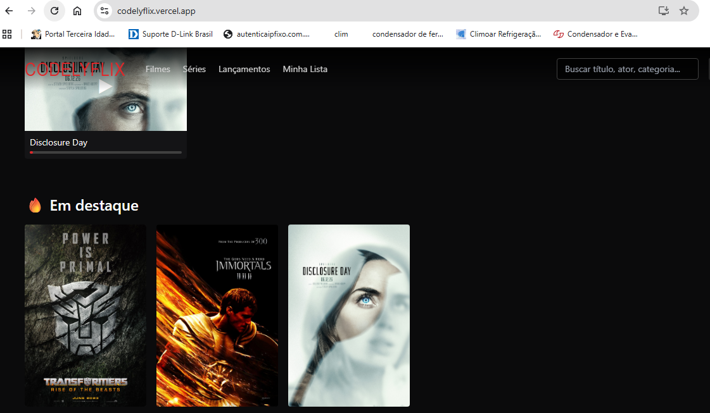
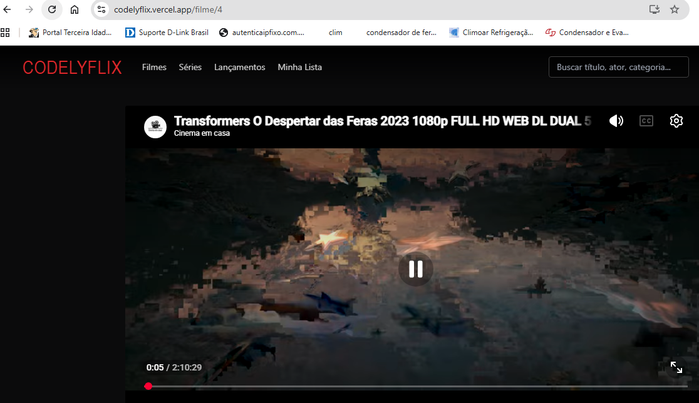
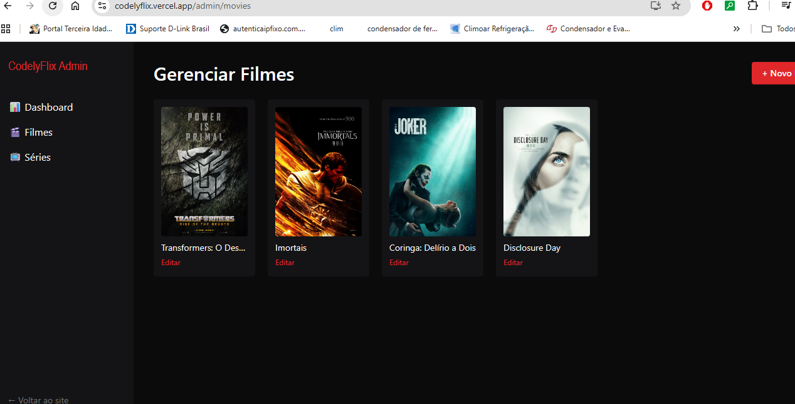

<div align="center">

# 🎬 CodelyFlix

**Plataforma de streaming de filmes e séries — full stack, autenticação real e app Android**

[](https://nextjs.org)
[](https://www.typescriptlang.org)
[](https://supabase.com)
[](https://tailwindcss.com)
[](./LICENSE)
[](#-app-android-apk)

*Um clone funcional de plataforma de streaming, construído do zero como projeto pessoal —
catálogo, player, autenticação, painel administrativo e app Android, tudo rodando
100% em infraestrutura gratuita.*

</div>

---

## 📸 Preview

<p align="center">
  
</p>
<p align="center">
  
  
</p>

> Ainda sem prints? Veja [`docs/screenshots/README.md`](docs/screenshots/README.md)
> para o guia de quais telas fotografar e como nomear os arquivos.

## ✨ Funcionalidades

| Área | O que tem |
|---|---|
| 🏠 **Catálogo** | Home com banner em destaque, fileiras por categoria, "Continue assistindo" |
| 🎬 **Filmes & Séries** | Página de detalhes, temporadas e episódios, elenco, direção, sinopse |
| 🔍 **Busca** | Full-text search em português (título, categoria) |
| 🔐 **Autenticação real** | Login/cadastro por e-mail e senha, Google e GitHub (OAuth via Supabase Auth + cookies) |
| 🔒 **Player protegido** | Catálogo é público; assistir exige login (redireciona e volta pro mesmo título depois) |
| ▶️ **Player de vídeo** | Suporta YouTube, Vimeo e links diretos (.mp4/.m3u8), legendas `.vtt`, progresso salvo automaticamente |
| 🛠️ **Painel Admin** | Dashboard, CRUD de filmes, cadastro de fontes de vídeo e legendas — tudo pelo navegador |
| ❤️ **Minha Lista** | Favoritos por usuário |
| 📱 **App Android (PWA/TWA)** | Instalável como app nativo, com ícone e splash próprios |
| 🛡️ **Banco seguro** | Row Level Security (RLS) em todas as tabelas sensíveis no Postgres/Supabase |

## 🧱 Stack técnica

- **Frontend/Backend**: [Next.js 14](https://nextjs.org) (App Router, Server Components, Route Handlers)
- **Linguagem**: TypeScript
- **Estilo**: Tailwind CSS
- **Banco de dados**: PostgreSQL via [Supabase](https://supabase.com)
- **Autenticação**: Supabase Auth (`@supabase/ssr`) — e-mail/senha, Google, GitHub
- **Player**: `react-player` (YouTube, Vimeo, HLS, MP4)
- **Hospedagem**: [Vercel](https://vercel.com) (deploy contínuo via GitHub)
- **App mobile**: PWA + [PWABuilder](https://www.pwabuilder.com) (Trusted Web Activity → `.apk`/`.aab`)

Toda a stack roda nos planos gratuitos dessas ferramentas.

## 🏗️ Arquitetura (visão geral)

```
┌─────────────────────┐        ┌──────────────────────────┐
│   Next.js (Vercel)  │◄──────►│   Supabase (Postgres)    │
│                     │        │                          │
│  • Server Components│        │  • Auth (users/sessions) │
│  • Route Handlers   │        │  • RLS policies          │
│  • Middleware       │        │  • Storage (opcional)    │
│    (protege /admin) │        │                          │
└──────────┬──────────┘        └──────────────────────────┘
           │
           ▼
┌─────────────────────┐
│  PWA → PWABuilder    │
│  → APK/AAB Android   │
└─────────────────────┘
```

## 🚀 Rodando localmente

### Pré-requisitos
- Node.js 18+
- Conta gratuita no [Supabase](https://supabase.com)

### 1. Clone e instale
```bash
git clone https://github.com/RodrigoName/codelyflix.git
cd codelyflix
npm install
```

### 2. Configure o banco de dados
No SQL Editor do seu projeto Supabase, rode o conteúdo de [`supabase/schema.sql`](./supabase/schema.sql).
Ele cria todas as tabelas, RLS policies e o trigger que gera automaticamente um perfil
(`role = 'user'`) para cada novo usuário cadastrado.

### 3. Configure as variáveis de ambiente
```bash
cp .env.local.example .env.local
```
Preencha com as chaves do seu projeto Supabase (**Settings → API Keys**):
```
NEXT_PUBLIC_SUPABASE_URL=
NEXT_PUBLIC_SUPABASE_ANON_KEY=
SUPABASE_SERVICE_ROLE_KEY=
```

### 4. Rode
```bash
npm run dev
```
Acesse [http://localhost:3000](http://localhost:3000).

## 👤 Virando administrador

1. Cadastre-se em `/login`
2. No Supabase, **Table Editor → profiles**, ache sua linha e mude `role` para `admin`
3. Acesse `/admin` — dashboard, CRUD de filmes e cadastro de vídeo/legenda já liberados

## ☁️ Deploy

1. Suba o repositório para o GitHub
2. Importe o projeto na [Vercel](https://vercel.com)
3. Configure as mesmas 3 variáveis de ambiente em **Project Settings → Environment Variables**
4. No Supabase, em **Authentication → URL Configuration**, adicione a URL de produção
   em **Site URL** e em **Redirect URLs** (`https://seu-projeto.vercel.app/**`)
5. Deploy automático a cada `git push`

## 📱 App Android (APK)

O projeto já inclui `manifest.json`, ícones e Service Worker (PWA pronta). Para gerar o `.apk`:

1. Publique o site (Vercel)
2. Acesse [pwabuilder.com](https://www.pwabuilder.com), cole a URL do site publicado
3. **Package for stores → Android** → preencha o Package ID e gere o pacote
4. Adicione o `assetlinks.json` gerado em `public/.well-known/assetlinks.json` (necessário
   para o app abrir em tela cheia, sem a barra de navegador) e faça o deploy de novo

📦 A última versão pronta para instalar está sempre disponível em
**[Releases](../../releases)** deste repositório.

## 🗺️ Roadmap

- [ ] CRUD completo de séries/temporadas/episódios no painel admin
- [ ] Gerenciamento de usuários e assinaturas
- [ ] Upload direto de vídeo/imagem (sem precisar colar link externo)
- [ ] Seletor manual de qualidade no player
- [ ] Publicação na Google Play Store

## ⚠️ Aviso sobre direitos autorais

Este é um projeto de **arquitetura de plataforma** para fins de estudo/portfólio.
Ele não distribui conteúdo protegido por direitos autorais — hospede apenas vídeos
próprios, com licença aberta, ou com autorização explícita dos detentores dos direitos.

## 📄 Licença

Distribuído sob a licença MIT. Veja [`LICENSE`](./LICENSE) para mais detalhes.

---

<div align="center">

Desenvolvido por **Rodrigo** — projeto pessoal de estudo em Next.js + Supabase.

</div>
